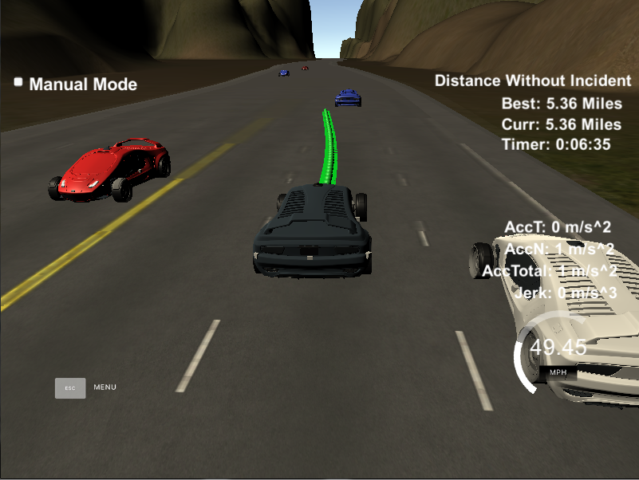

# **Path Planning Project** 

## Built by Dmitry Zaganich in March 2018.

**The Goal of this Project**
In this project, my goal was to design a path planner that is able to create smooth, safe paths for the car to follow along a 3 lane highway with traffic. 

The car should try to go as close as possible to the 50 MPH speed limit, which means passing slower traffic when possible. 
The car should avoid hitting other cars at all cost as well as driving inside of the marked road lanes at all times, unless going from one lane to another. 
The car should be able to make one complete loop around the 6946m highway. 
The car should not experience total acceleration over 10 m/s^2 and jerk that is greater than 10 m/s^3.

---
### Files

To ensure transparency of the project's design, I have split my path planning code into following modules: 
* main.cpp. The main file of the project, which takes data from simulator, builds a trajectory using modules below and passes the trajectory to the simulator.
* trajectory.cpp & trajectory.h. Contains the Trajectory class, which stores an abstract future path of a vehicle in form of coordinates, which are split into X and Y vectors. 
* trajectory_builder.cpp & trajectory_builder.h. Contains a TrajectoryBuilder class, which can build a Trajectory object using a horizon and vehicle data.
* vehicle.cpp & vehicle.h. Contains the Vehicle class, which stores and updates parametres of a vehicle. It also can predict trajectory of itself (using TrajectoryBuilder and Trajectory classes) and check for collisions with some other trajectory. 
* road.cpp & road.h. Contains the Road class, which stores and updates current list of vehicles on a road, manages the sensor range, checks for collisions and provides an interface to get various data about current road situation. 
* behavior.cpp & behavior.h. Contains the Behavior class, which manages states of the Finite State Machine of the car using cost functions. 
* utils.h. Contains utils functions, such as distance, frenet/xy coordinate transitions etc. 

The project also contains "spline.h" library which is used to build smooth paths in the TrajectoryBuilder class as it was suggested in the project's walkthrough. 

For more details of the implementation, look into writeup.md file.
