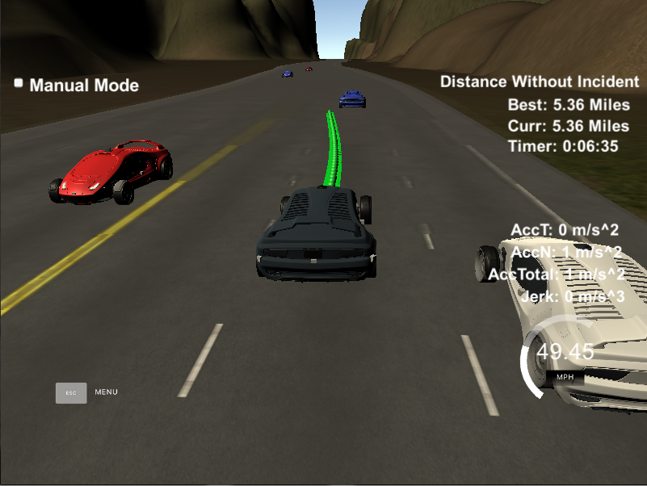
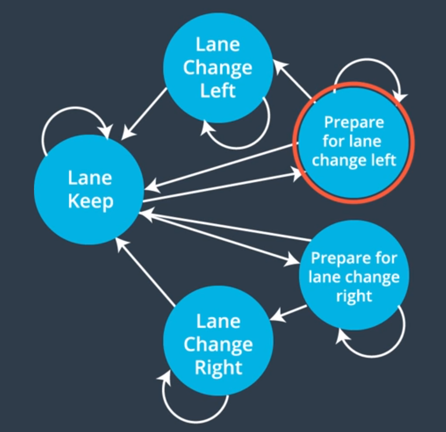

#**Path Planning Project** 

## Built by Dmitry Zaganich in March 2018.



## Writeup 

---

**The Goal of this Project**
In this project, my goal was to design a path planner that is able to create smooth, safe paths for the car to follow along a 3 lane highway with traffic. 

The car should try to go as close as possible to the 50 MPH speed limit, which means passing slower traffic when possible. 
The car should avoid hitting other cars at all cost as well as driving inside of the marked road lanes at all times, unless going from one lane to another. 
The car should be able to make one complete loop around the 6946m highway. 
The car should not experience total acceleration over 10 m/s^2 and jerk that is greater than 10 m/s^3.

## Rubric Points
### Here I will consider the [rubric points](https://review.udacity.com/#!/rubrics/432/view) individually and describe how I addressed each point in my implementation.  

---
### Compilation

To ensure transparency of the project's design, I have split my path planning code into following modules: 
* main.cpp. The main file of the project, which takes data from simulator, builds a trajectory using modules below and passes the trajectory to the simulator.
* trajectory.cpp & trajectory.h. Contains the Trajectory class, which stores an abstract future path of a vehicle in form of coordinates, which are split into X and Y vectors. 
* trajectory_builder.cpp & trajectory_builder.h. Contains a TrajectoryBuilder class, which can build a Trajectory object using a horizon and vehicle data.
* vehicle.cpp & vehicle.h. Contains the Vehicle class, which stores and updates parametres of a vehicle. It also can predict trajectory of itself (using TrajectoryBuilder and Trajectory classes) and check for collisions with some other trajectory. 
* road.cpp & road.h. Contains the Road class, which stores and updates current list of vehicles on a road, manages the sensor range, checks for collisions and provides an interface to get various data about current road situation. 
* behavior.cpp & behavior.h. Contains the Behavior class, which manages states of the Finite State Machine of the car using cost functions. 
* utils.h. Contains utils functions, such as distance, frenet/xy coordinate transitions etc. 

The project also contains "spline.h" library which is used to build smooth paths in the TrajectoryBuilder class as it was suggested in the project's walkthrough. 


### Valid Trajectories

####1. The car is able to drive at least 4.32 miles without incident

After I've finished implementation of my path planner, the car was able to drive more than 4.32 miles without any incident. 

####2. The car drives according to the speed limit.

The car has hard-coded speed limit of 49.5 miles per hour, which is defined in behavior.h along with other behavior-related parametres:

```
	double speed_limit = 49.5;
	double target_speed = speed_limit;
	double sensor_range = 400.0;
	double min_safe_distance_threshold = 15.0;
	double collision_threshold = 10.0;
	double velocity_change = 0.224;
	double block_distance_threshold = min_safe_distance_threshold * 2;
```

On each tick of the parametres update in main.cpp, the update() method of Behavior object is called:

```
	void update(vector<double> previous_path_x, vector<double> previous_path_y,
		            vector<double> map_waypoints_x, vector<double> map_waypoints_y,
		            vector<double> map_waypoints_s);
```

This method is calling two inner methods of Behavior class:
The method updateState() estimates the current state and possible state transitions using cost functions. After that, it desides which state should be on this time tick. 
The method updateParams() handles velocity changes, taking into consideration the closest vehicle in the lane or the absence of one. In this method the behaviour planner accelerates or decelates the vehicle according to the target speed parameter. The target speed parameter is initially the same, as speed_limit and changes in the "follow_closest_vehicle" method:


```
	void Behavior::follow_closest_vehicle() {
		Vehicle *closest_vehicle_ahead = road->get_closest_vehicle_ahead_of(this->cur_vehicle);
		bool has_vehicle_ahead = closest_vehicle_ahead != NULL;
		if (has_vehicle_ahead) {
		    double check_car_s = closest_vehicle_ahead->s;
		    double check_car_speed = closest_vehicle_ahead->speed;

		    printf("\r\n");
		    printf("|Closest car speed: %f|", check_car_speed);

		    check_car_s += this->previous_path_x.size() * 0.02 * closest_vehicle_ahead->speed;
		    double distance = std::abs(check_car_s - this->cur_vehicle->s);

		    printf("\r\n");
		    printf("|Distance to the closest car : %f|", distance);

		    if (check_car_s > cur_vehicle->s && distance < this->min_safe_distance_threshold) {
		        // check if car ahead us behaves well. No reason to blindly follow a crazy driver
		        this->target_speed = std::min(check_car_speed, this->speed_limit);
		    } else {
		        this->target_speed = this->speed_limit;
		    }
		} else {
		    this->target_speed = this->speed_limit;
		}

		this->target_lane = this->cur_vehicle->lane;
	}
```
 
####3. Max Acceleration and Jerk are not Exceeded.

This constraint is handled by "double velocity_change = 0.224;" hyperparameter in behavior.h. This value was taken from the project's walkthough and it's applied in the updateParams() method of Behavior class:

```
        printf("\r\n");
        printf("|Target speed: %f|", this->target_speed);
        printf("\r\n");
        printf("|Target lane: %d|", this->target_lane);

        printf("\r\n");
        if (this->ref_velocity < this->target_speed) {
            printf("|Speed policy: increase speed|");
            this->ref_velocity = std::min(this->ref_velocity + this->velocity_change, this->target_speed);
        } else if (this->ref_velocity == this->target_speed) {
            printf("|Speed policy: keep max speed|");
        } else {
            printf("|Speed policy: decrease speed|");
            this->ref_velocity -= this->velocity_change;
        }
```

####4. Car does not have collisions.

This rubric point is achieved by assigning the highest cost to the states which contrain trajectories which might collide with other vehicles. An example for a Lane Change Left state: 

```
	(from evaluate_next_state(State state) method in Behavior.cpp)
	 
	if (state == State::LaneChangeLeft) {
		    if (this->state == State::PrepareLaneChangeLeft) {

		        int next_lane = this->cur_vehicle->lane - 1;

		        if (this->has_collision_on_lane_change(next_lane)) {
		            return 1;
		        }

		        return 0;
		    } else if (this->state == State::LaneChangeLeft) {
		        return 0.5;
		    } else {
		        return 1;
		    }
	}

```

```
	bool Behavior::has_collision_on_lane_change(int trajectory_lane) {
		TrajectoryBuilder trajectoryBuilder;


		Trajectory trajectory = trajectoryBuilder.build_trajectory(this->cur_vehicle->x,
		                                                           this->cur_vehicle->y,
		                                                           this->cur_vehicle->s,
		                                                           this->cur_vehicle->yaw,
		                                                           trajectory_lane,
		                                                           this->ref_velocity,
		                                                           this->previous_path_x,
		                                                           this->previous_path_y,
		                                                           this->map_waypoints_x,
		                                                           this->map_waypoints_y,
		                                                           this->map_waypoints_s);

		bool has_collisions = road->has_collisions(trajectory, this->collision_threshold, trajectory_lane);

		return has_collisions;
	}
```

As an addditional safeguard, I've implemented logic to force the car to keep the minimum distance to the closest vehicle in it's lane. This parameter is being controlled by "min_safe_distance_threshold" in behavior.h  

```
	void Behavior::follow_closest_vehicle() {
		Vehicle *closest_vehicle_ahead = road->get_closest_vehicle_ahead_of(this->cur_vehicle);
		bool has_vehicle_ahead = closest_vehicle_ahead != NULL;
		if (has_vehicle_ahead) {
		    double check_car_s = closest_vehicle_ahead->s;
		    double check_car_speed = closest_vehicle_ahead->speed;

		    printf("\r\n");
		    printf("|Closest car speed: %f|", check_car_speed);

		    check_car_s += this->previous_path_x.size() * 0.02 * closest_vehicle_ahead->speed;
		    double distance = std::abs(check_car_s - this->cur_vehicle->s);

		    printf("\r\n");
		    printf("|Distance to the closest car : %f|", distance);

		    if (check_car_s > cur_vehicle->s && distance < this->min_safe_distance_threshold) {
		        // check if car ahead us behaves well. No reason to blindly follow a crazy driver
		        this->target_speed = std::min(check_car_speed, this->speed_limit);
		    } else {
		        this->target_speed = this->speed_limit;
		    }
		} else {
		    this->target_speed = this->speed_limit;
		}

		this->target_lane = this->cur_vehicle->lane;
	}
```

####5. The car stays in its lane, except for the time between changing lanes.

This rubric point is implemented inside TrajectoryBuilder class using "spline.h" library in the method:

```
	Trajectory TrajectoryBuilder::build_trajectory(double car_x, double car_y, double car_s,
                                                   double car_yaw, int target_lane, double ref_velocity,
                                                   vector<double> previous_path_x, vector<double> previous_path_y,
                                                   vector<double> map_waypoints_x, vector<double> map_waypoints_y,
                                                   vector<double> map_waypoints_s) 
```

This method generates new waypoints using the algorithm:
- using Frenet coordinate S and the target lane, we get coorinates of 3 "anchorage" waypoints in the future. 
- we build a spline between these waypoints and previousle generated waypoints
- we fill our path with previously generated waypoints which were not consumed by the car to ensure smooth transitions
- we build intermidiate waypoints between "anchorage" waypoints and using the spline

The key to lane keeping is in the first line of the algorithm: the target lane is used to generate D coordinate which is used in the "anchorage" watpoints. As long as we just keep our lane, the waypoints of the future trajectory will use the same lane.

####6. The car is able to change lanes

The car can change lane if we pass a target lane, which is different from our current lane, to the trajectory builder. In this case, trajectory builder will build anchorage waypoints using other lane, so the spline will generate smooth transition between lanes.

### Reflection

The main goal of this projects is to build a path planner which generates smooth and safe paths for the vehicle, while allowing the vehicle to follow the most optimal way possible.
I achieved this goal using Finite State Machine which was suggested in the lectures and a cost functions for each state transition. 

The FSM which I used was:

 

Which is directly implemented in this method below of the Behavior class. Note that state transitions are happening if the cost of this transition is the smallest of all possible costs.

```

    void Behavior::updateState() {

        milliseconds cur_time = duration_cast<milliseconds>(
                system_clock::now().time_since_epoch()
        );

        this->observation_time = cur_time;

        printf("\r\n");
        printf("Current lane: %d", this->cur_vehicle->lane);
        printf("%s", this->has_collision_on_lane_change(0) ? "| X |" : "|  |");
        printf("%s", this->has_collision_on_lane_change(1) ? "| X |" : "|  |");
        printf("%s", this->has_collision_on_lane_change(2) ? "| X |" : "|  |");

        this->update_road_observation();

        if (this->state == State::KeepLane) {

            double keep_lane_cost = this->evaluate_next_state(State::KeepLane);
            double lane_change_right_cost = this->evaluate_next_state(State::PrepareLaneChangeRight);
            double lane_change_left_cost = this->evaluate_next_state(State::PrepareLaneChangeLeft);

            printf("\r\n");
            printf("|KL: %f|PLCR: %f|PLCL: %f|", keep_lane_cost, lane_change_right_cost, lane_change_left_cost);

            vector<double> costs;
            costs.push_back(keep_lane_cost);
            costs.push_back(lane_change_right_cost);
            costs.push_back(lane_change_left_cost);

            double min = minAt(costs);

            if (lane_change_right_cost == min) {
                this->state = State::PrepareLaneChangeRight;
            } else if (lane_change_left_cost == min) {
                this->state = State::PrepareLaneChangeLeft;
            } else {
                this->state = State::KeepLane;
            }

        } else if (this->state == State::PrepareLaneChangeRight || this->state == State::PrepareLaneChangeLeft) {

            double keep_lane_cost = this->evaluate_next_state(State::KeepLane);
            double lane_change_right_cost = this->evaluate_next_state(State::PrepareLaneChangeRight);
            double lane_change_left_cost = this->evaluate_next_state(State::PrepareLaneChangeLeft);

            printf("\r\n");
            printf("|KL: %f|PLCR: %f|PLCL: %f|", keep_lane_cost, lane_change_right_cost, lane_change_left_cost);

            vector<double> costs;
            costs.push_back(keep_lane_cost);
            costs.push_back(lane_change_right_cost);
            costs.push_back(lane_change_left_cost);

            double min = minAt(costs);

            if (lane_change_right_cost == min) {
                this->state = State::PrepareLaneChangeRight;
            } else if (lane_change_left_cost == min) {
                this->state = State::PrepareLaneChangeLeft;
            } else {
                this->state = State::KeepLane;
                return;
            }

            double change_lane_cost =
                    this->state == State::PrepareLaneChangeRight ? this->evaluate_next_state(State::LaneChangeRight)
                                                                 : this->evaluate_next_state(State::LaneChangeLeft);
            bool change_lane = change_lane_cost < lane_change_right_cost;

            printf("\r\n");
            printf("|CL: %f|PLCR: %f|PLCL: %f|", change_lane_cost, lane_change_right_cost, lane_change_left_cost);

            if (change_lane) {
                if (this->state == State::PrepareLaneChangeRight) {
                    this->state = State::LaneChangeRight;
                    this->target_lane = this->cur_vehicle->lane + 1;
                    this->target_speed = this->ref_velocity;
                } else {
                    this->state = State::LaneChangeLeft;
                    this->target_lane = this->cur_vehicle->lane - 1;
                    this->target_speed = this->ref_velocity;
                }
            }
        } else if (this->state == State::LaneChangeRight || this->state == State::LaneChangeLeft) {
            double keep_lane_cost = this->evaluate_next_state(State::KeepLane);
            double change_lane_cost =
                    this->state == State::LaneChangeRight ? this->evaluate_next_state(State::LaneChangeRight)
                                                          : this->evaluate_next_state(State::LaneChangeLeft);

            printf("\r\n");
            printf("|KL: %f|CL: %f|", keep_lane_cost, change_lane_cost);

            if (keep_lane_cost < change_lane_cost) {
                this->state = State::KeepLane;
            }
        }
    }

```

So, what are these "cost functions" which are really control the behavior of the car? Let's dive in.

The main three factors which I use in my cost functions are:
* is our vehicle "blocked" in it's lane? This factor is computed in update_road_observation() method, which is called in the updateState();
* what are the "lane speeds" of our lane and our neighbour lanes?
* is the transitioning state leading us into collision with another car?

So, I've written a pretty simple cost function which produces value in [0, 1]. The value 0 is "the best", 1 is "impossible/extremely unsafe". The behavior, which this cost function provides, is:

* if we are keeping our lane, we check if we are blocked by another car. If not, we just keep the lane and accelerate up to the target speed. 

* if we are blocked, when we evaluate the speed of each possible lane. The speed is computed pretty straign forward: as the speed of the closest car ahead in each lane. if some lane has better speed than us and we are blocked, we initiate transition to this lane. If not, we just keep the safe distance to the closest car in lane and match it's speed.

* if we are in "transition" state as Prepare Lane Change Right/Left, we look if estimated trajectory to the new target lane has collisions with other vehicles. If it has, we just keep our lane. If not, we change our target lane.

* if we are in the middle of lane transition, we do not change our next state in the closest 250 milliseconds. This is used to ensure that the car does not take any other sudden decisions in the time of lane change

The cost functions are implemented in the Behavior class:

```

    double Behavior::evaluate_lane_speed(int lane) {
        vector<double> speeds = road->get_speed_of_closest_vehicles_for(this->cur_vehicle);
        for (int i = 0; i < speeds.size(); i++) {
            if (speeds[i] > this->speed_limit) {
                speeds[i] = this->speed_limit;
            }
        }

        double max = maxAt(speeds);

        return (1 - (speeds[lane] / max)) + 0.1;
    }

    double Behavior::evaluate_next_state(State state) {

        if (state == State::KeepLane) {

            if (this->state == State::LaneChangeRight || this->state == State::LaneChangeLeft) {
                if (this->cur_vehicle->lane == this->target_lane) {
                    if (this->last_lane_change_millisec == 0) {
                        this->last_lane_change_millisec = this->observation_time.count();
                    }
                    auto time_diff = this->observation_time.count() - this->last_lane_change_millisec;
                    if (time_diff > this->lane_transition_millisec) {
                        this->last_lane_change_millisec = 0;
                        return 0;
                    }
                }
                return 1;
            }

            if (this->blocked_in_lane) {
                return this->evaluate_lane_speed(this->cur_vehicle->lane);
            } else {
                return 0;
            }

        } else if (state == State::PrepareLaneChangeLeft) {

            if (this->state == State::LaneChangeLeft || this->state == State::LaneChangeRight) {
                return 1;
            }

            int next_lane = this->cur_vehicle->lane - 1;
            if (next_lane < 0) {
                return 1;
            }
            return this->evaluate_lane_speed(next_lane);

        } else if (state == State::PrepareLaneChangeRight) {

            if (this->state == State::LaneChangeLeft || this->state == State::LaneChangeRight) {
                return 1;
            }

            int next_lane = this->cur_vehicle->lane + 1;
            if (next_lane >= road->lanes) {
                return 1;
            }
            return this->evaluate_lane_speed(next_lane);

        } else if (state == State::LaneChangeRight) {

            if (this->state == State::PrepareLaneChangeRight) {

                int next_lane = this->cur_vehicle->lane + 1;

                if (this->has_collision_on_lane_change(next_lane)) {
                    return 1;
                }

                return 0;
            } else if (this->state == State::LaneChangeRight) {
                return 0.5;
            } else {
                return 1;
            }

        } else if (state == State::LaneChangeLeft) {
            if (this->state == State::PrepareLaneChangeLeft) {

                int next_lane = this->cur_vehicle->lane - 1;

                if (this->has_collision_on_lane_change(next_lane)) {
                    return 1;
                }

                return 0;
            } else if (this->state == State::LaneChangeLeft) {
                return 0.5;
            } else {
                return 1;
            }
        }
    }

```


### Discussion

I was able to build a path planner which met all of the project's rubric points. 

However, there is still a room to improve the algorithm. 
The code which follows the target car is far from perfect because our car is constantly accelerating/decelerating to match the speed of the vehicle ahead. 
The cost function is also very basic and might be improved by taking into account vehicles in the back of our car. We also might take into account that speed of lanes might be different just by a smallest degrees of double, so usage of strict operators like > and < might be changed to some computing difference between speeds and application of some thresholds.
The collision detection code is also might be done better, to eliminate uncertainty of rough distance estimations between trajectory points.

All in all, it was a very fun project and I've spent a great deal of time on it's implementation. 
